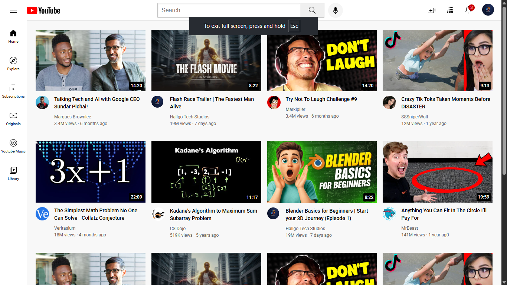

# YouTube Clone (HTML & CSS)

A clean and responsive clone of the YouTube homepage built using only HTML and CSS.

## 🚀 Features
- Responsive layout
- Sidebar navigation
- Video grid section
- Top navigation bar
- Hover effects
- Modern UI design

## 🛠️ Built With
- HTML5
- CSS3 (Flexbox & Grid)

## 📂 Folder Structure
youtube-clone/
- │── index.html  
- │── style/  
- │── assets/
- │── channel-pictures/
- │── thumbnails/
- │── icons/
  

## 🎯 Purpose
This project was built to practice frontend layout structuring and responsive design without JavaScript.

## 📸 Preview

## 📄 License
This project is licensed under the MIT License.
